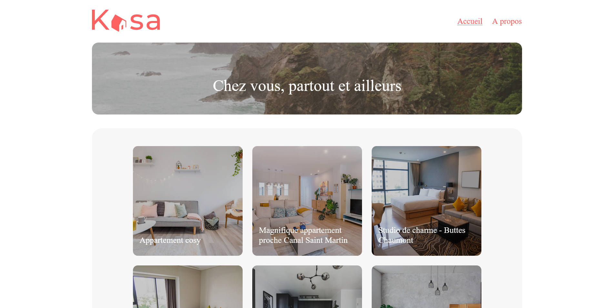
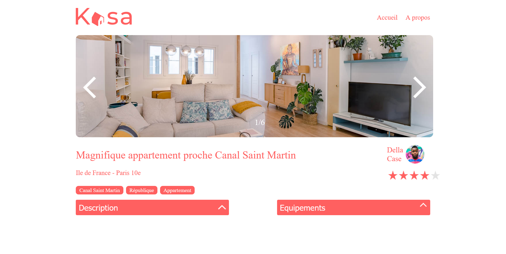

# Kasa (formation OpenClassrooms)

 
  

## Intégration de maquètes avec réact

## Technos :

## Description:
Front react bootstrapped avec create-react-app. 
Une page d'accueil avec des logements. 
Une page de focus sur un logement avec ses spécificités. 

## URL :
> https://kasatb.netlify.app/

### Installer les dépendances:

`npm install`

### Lancer l'application:

`npm run start`
